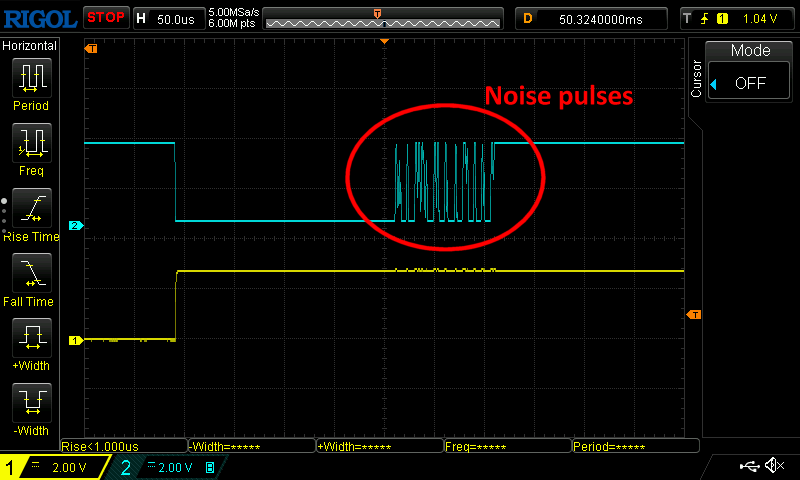
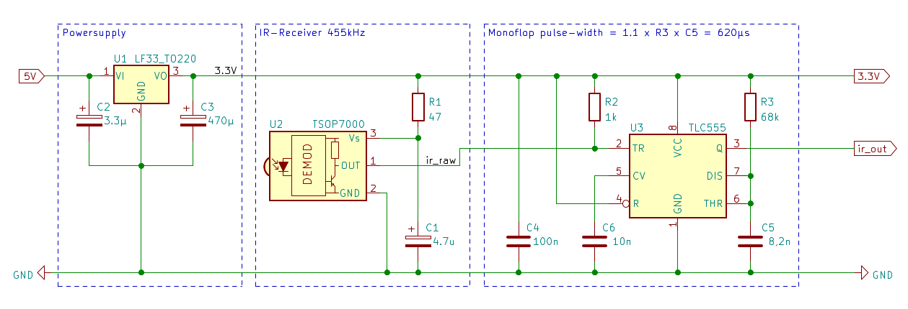

# esp32_beo4
Library for Bang & Olufsen Beo4 remote control, using a TSOP7000 IR receiver and a ESP32
# 1. Examples
*Notes:*
*The pioarduino based arduino-esp32 platform is used, in order to support newer boards like ESP32-C6.*

- arduino-esp32 migration 2.x to 3.0<br>
https://docs.espressif.com/projects/arduino-esp32/en/latest/migration_guides/2.x_to_3.0.html#ledc

- arduino-esp32 for platformio<br>
https://github.com/pioarduino/platform-espressif32


### `platformio.ini` 
```
[env:esp32dev]
platform = https://github.com/pioarduino/platform-espressif32/releases/download/stable/platform-espressif32.zip
board = esp32dev
framework = arduino
```


## 1.1 Example with receive task (examples/esp32_beo4_rx)
In previous releases there was the call back function `beo_code_cb()`, but it turned out that it is suitable to just print the codes, but anything else will generate to disturbances of the receiver task ending in unreadable codes. Therefore the critical call back funtion `beo_code_cb()` was removed. The queue based aproach is the better solution. A simple receiver main.cpp example looks like so:

```cpp
#include <Arduino.h>
#include "IrBeo4.h"

#define IR_RX_PIN 34            // IR receive pin
IrBeo4 beo4(IR_RX_PIN);         // instance

xQueueHandle beo4_rx_queue;     // queue 
TaskHandle_t beo4_task_h;       // task handle

void beo4_task(void *parameter) {
  static uint32_t beo4Code=0;
  while(1) {
    if(pdTRUE==xQueueReceive(beo4_rx_queue,(void*)(&beo4Code),portMAX_DELAY)) {
      Serial.printf("beo4_task:   %04x %s %s\n",
                    beo4Code,
                    beo_src_tbl(beo4Code),
                    beo_cmd_tbl(beo4Code));
    }
  }
}


void setup() {
  Serial.begin(115200);
  beo4_rx_queue = xQueueCreate(50, sizeof(uint32_t));
  xTaskCreatePinnedToCore(beo4_task,"beo4_task",10000,NULL,0,&beo4_task_h,0);
  beo4.Begin(beo4_rx_queue);
  printf("beo4 started, RX=%d\n",IR_RX_PIN);
}

void loop() {
}

```

## 1.2 Example with transmit task (examples/esp32_beo4_tx)
An example of the send function can be found under examples/esp32_beo4_tx. There is also a working circuit for the IR transmitter. The use of 880nm IR diodes is recommended, in the B&O service manuals you will find references to the receiver circuit and 880nm wavelength is described there. Details see --> https://github.com/aanban/esp32_beo4/tree/main/examples/esp32_beo4_tx/readme.txt


## 1.3 Home Assistant MQTT auto discovery example
Using the MQTT auto discovery feature for Home Assistant integration
Details see --> https://github.com/aanban/esp32_beo4/tree/main/examples/esp32_beo4_HA/readme.md


# 2. TSOP7000 Issues
The Bang & Olufsen IR remote control Beo4 works with a carrier frequency of 455kHz. A suitable decoder device is the TSOP7000 from Vishay. However, the
[production has been stopped in 2009](https://www.vishay.com/files/whatsnew/doc/ff_FastFacts_CounterfeitTSOP7000_Dec72018.pdf) 
.
Replicas appeared a few years ago , but unfortunately they do not work the same way and have bad habits producing **dummy pulses** and having **hiccups** sometimes. 

The tsop7000 replicas, that I have tested, in principle decodes a low-activ pulse from a 455kHz carrier burst, as expected. The Beo4 carrier bursts have a length of 200&mu;s, i.e. after the 200&mu;s low pulse the ir_raw signal should toggle and stay at high-level to indicate the pause. But my tested replicas do have this bad habit of not switching to high in a proper manner. The picture below shows the dummy pulses that occur sporadically after 200&mu;s.  (blue = TSOP7000 output signal). 

Another issue is that the tested TSOP7000 are quite sensitive and react to sunlight or whatever, anyway I observed sporadic pulses on the output even without pressing any button on the Beo4 remote control. 




## 2.1. Approach to avoid the dummy pulses
The low pulses are not important for decoding the received signal, i.e. only the total length (falling edge --> falling edge) is important.

> [!NOTE]
> The PulseWidth is measured as time between two falling edges and converted to PulseCodes.  
PulseWidth[µs] = t<sub>new_edge</sub> - t<sub>previous_edge</sub>


The low pulses can therefore also be extended in order to suppress the interference pulses. I have tested two work arrounds, a hardware-based monoflop approach and a software-based debouncing solution. 


### 2.1.1. Hardware work arround
In terms of hardware, a monoflop can suppress the interference pulses. The following circuit with a TLC555 has worked. The low pulse is extended to ca. 620µs. The output signal `ir_out` is high-active, therefore `mode=RISING` must be set in the `attachInterrupt()` function instead of `mode=FALLING`.  



### 2.1.2. Software solution
The software-based work-arround is easier to implement.  Debouncing (similar to debouncing of buttons) is implemented within the interrupt service routine. Timestamps are measured for each interrupt and compared with the previous interrupt. The timestamp is put into the `g_isr_queue` queue only, if the previous interrupt was more than `t_debounce=600µs` ago, i.e. the short interference pulses will be suppressed.

```cpp
// interrupt service routine
void IRAM_ATTR ir_pulse_isr(void) {
  static int64_t tsPre=0;              // timestamp of previous edge
  int64_t tsNew=esp_timer_get_time();  // timestamp of new edge
  if((tsNew-tsPre) > t_debounce ) {    // debounce TSOP7000 output
    xQueueSend(g_isr_queue,&tsNew,0);  // send timestamp to queue if valid low pulse
    tsPre=tsNew;
  }
}
```
The TSOP7000 output is `low-activ`, therefor `mode=FALLING` must be set in the `attachInterrupt()` function.

```cpp
  // attach interrupt to TSOP7000 output, and set to falling edge
  if(-1!=m_rx_pin) { 
    pinMode(m_rx_pin, INPUT);
    attachInterrupt(m_rx_pin, ir_pulse_isr, FALLING);
  } 
```


# 3. Decoding B&O Beo4 remote control codes
Further information about the Beo4 remote control code-format can be found here: 
  
  | Comment          | Link                                                           |
  | ----------------:|:---------------------------------------------------------------|
  | `data-link manual` | https://www.mikrocontroller.net/attachment/33137/datalink.pdf  |
  | `Beomote`          | https://github.com/christianlykke9/Beomote                     |
  
## 3.1. Mapping PulseWidth to PulseCode
Pulses have different widths and corresponding PulseCodes as seen in the table below.

> [!NOTE]
>The different pulse-widths are multiples of 3125us, i.e. the PulseCode can be calculated this way:  
PulseCode = (t<sub>new_edge</sub> - t<sub>previous_edge</sub> + 1562) / 3125
  
  
  | PulseWidth | PulseCode | define          | Comment                     |
  | ----------:|:---------:|:----------------|:----------------------------|
  |   3125 µs  | 1         | `` BEO_ZERO  `` | bit = 0                     |
  |   6250 µs  | 2         | `` BEO_SAME  `` | bit = same as previous bit  |
  |   9375 µs  | 3         | `` BEO_ONE   `` | bit = 1                     |
  |  12500 µs  | 4         | `` BEO_STOP  `` | stop-code                   |
  |  15625 µs  | 5         | `` BEO_START `` | start-code                  |

The picture below shows the frame start with two short pulses and long pulse, that results in a PulseCode sequence `` BEO_ZERO ``,`` BEO_ZERO ``, `` BEO_START ``


## 3.2. Decoding Beo4 PulseCode sequences

The Beo4 remote control generates the PulseCode sequences with a total length of 21 pulses as seen below


 A complete Beo4 frame with 21 PulseCodes consists of the start-sequence `` BEO_ZERO `` , `` BEO_ZERO `` , `` BEO_START ``, followed by the 17 payload data codes each in the range [`` BEO_ZERO `` , `` BEO_SAME `` , `` BEO_ONE ``] and ends with the `` BEO_STOP `` code.
  
Within the payload data the PulseCodes are mapped to BitCodes as followed:   
```
PulseCode     BitCode
---------     ----------
BEO_ZERO  --> BitCode=0 
BEO_ONE   --> BitCode=1 
BEO_SAME  --> BitCode=previous BitCode 
```
> [!NOTE]
>*The `` BEO_SAME `` code was probably introduced to get approximately the same frame length for all Beo4 buttons. Otherwise, Beo4 commands with many 0-data-bits (e.g. TV-0 button) would become much shorter than those with many 1-data-bits. `` BEO_ZERO `` consumes 3.2ms and `` BEO_ONE `` consumes 9.3ms.*

The 17 Bit payload is devided into 3 data fields `` beoLink `` (1-Bit), `` beoSource `` (8-Bit) , and  `` beoCommand `` (8-Bit).  The `` beoSource `` indicates the device, e.g `` Audio`` , `` Video `` , `` Light `` and so on. The `` beoCommand `` indicates the current button, e.g. `` 0 `` , `` left ``, `` right ``, `` volume ++ `` and so on. 


```
//            _   ___________________   ____________
// ir_raw      |_|                   |_|
//              ___                   ___
// ir_out     _|   |_________________|   |__________
//
//             |<----PulseWidth----->|
//
//            Start      Data                                               Stop  
// ir_out     |_|_|_____|_|__|__|__|___|__|_|___|__|_|__|__|__|___|_|__|___|____|
// PulseCodes  1 1 5     1 2  2  2  3   2  1 3   2  1 2  2  2  3   1 2  3   4
// BitCodes              0 0  0  0  1   1  0 1   1  0 0  0  0  1   0 0  1   
// Payload     beoLink__/  |<---beoSource------->|  |<---beoCommand---->|
//                               
// BeoCode    = 0 00011011 00001001 = 0x01B09 
// beoLink    = 0
// beoSource  = 0x1B = LIGHT
// beoCommand = 0x09 = 9
// 
```


> [!NOTE]
>*It turned out that the decoded data field `` beoLink `` is always=0 for all buttons I tested with the Beo4 remote control. Well, this information can be skipped so that a complete BeoCode fits into two bytes.* 

### 3.2.1. Example of the "TV on" button

   |           | Start|beoLink |beoSource |beoCommand | Stop |
   |----------:| -----|:------:|:--------:|:---------:|:----:|
   | PulseCode | 115  | 1      | 2222 2222| 3122 2222 |  4   |
   | BitCode   |      | 0      | 0000 0000| 1000 0000 |      |
   | beoCode   |      | 0      | 0x00     | 0x80      |      |
   | Button    |      |        | video    | TV on     |      |

### 3.2.2. Example of the "LIGHT - #9" button

   |           | Start|beoLink |beoSource |beoCommand | Stop |
   |----------:| -----|:------:|:--------:|:---------:|:----:|
   | PulseCode | 115  | 1      | 2223 2132| 1222 3123 |   4  |
   | BitCode   |      | 0      | 0001 1011| 0000 1001 |      |
   | beoCode   |      | 0      | 0x1B     | 0x09      |      |
   | Button    |      |        | light    | # 9       |      |

### 3.2.3. Example of the "Audio - vol++" button

   |           | Start|beoLink |beoSource |beoCommand | Stop |
   |----------:| -----|:------:|:--------:|:---------:|:----:|
   | PulseCode | 115  | 1      | 2222 2223| 1321 2222 |   4  |
   | BitCode   |      | 0      | 0000 0001| 0110 0000 |      |
   | beoCode   |      | 0      | 0x01     | 0x60      |      |
   | Button    |      |        | audio    | vol++     |      |

### 3.2.4. Example of the "Audio - vol--" button

   |           | Start|beoLink |beoSource |beoCommand | Stop |
   |----------:| -----|:------:|:--------:|:---------:|:----:|
   | PulseCode | 115  | 1      | 2222 2223| 1321 2312 |   4  |
   | BitCode   |      | 0      | 0000 0001| 0110 0100 |      |
   | beoCode   |      | 0      | 0x01     | 0x64      |      |
   | Button    |      |        | audio    | vol--     |      |


> [!NOTE]
>*During my tests with the Beo4 remote and the TSOP7000 hiccups I noticed that the ``Light`` button behaves quite special. I got valid frames without having touched the Beo4-remote at all. Once the ``Light`` button is pressed, after a minute or so the Beo4-remote automatically jumps back to the mode, that has been active before, e.g. ``Radio``, ``TV`` and so on. In that case the following frame is send: ``beoSource=0x1B=Light`` and ``beoCommand=0x58=list``* 


