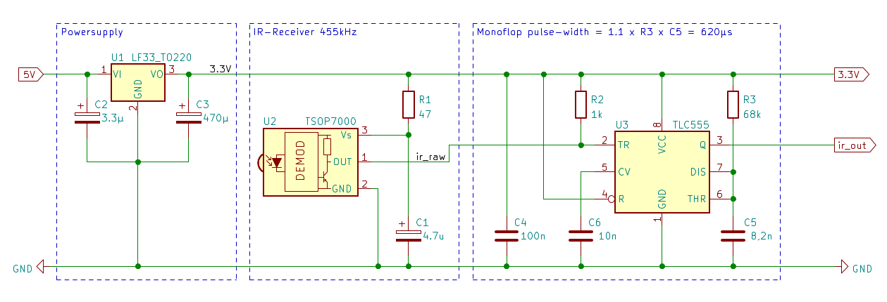
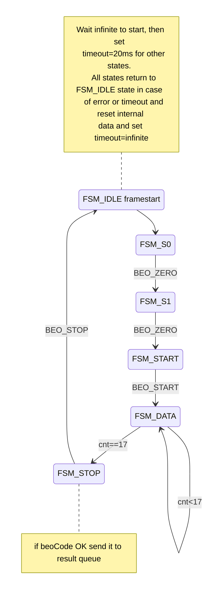

# esp32_beo4

The Bang & Olufsen IR remote control Beo4 works with a carrier frequency of 455kHz. A suitable decoder device is the TSOP7000 from Vishay. However, the
[production has been stopped in 2009](https://www.vishay.com/files/whatsnew/doc/ff_FastFacts_CounterfeitTSOP7000_Dec72018.pdf) 
.
Replicas appeared a few years ago , but unfortunately they do not work the same way and have bad habits producing **dummy pulses** and having **hiccups** sometimes. 

The tsop7000 replicas, that I have tested, in principle decodes a low-activ pulse from a 455kHz carrier burst, as expected. The Beo4 carrier bursts have a length of 200&mu;s, i.e. after the 200&mu;s low pulse the ir_raw signal should toggle and stay at high-level to indicate the pause. But my tested replicas do have this bad habit of not switching to high in a proper manner. The picture below shows the dummy pulses that occur sporadically after 200&mu;s.  (blue = TSOP7000 output signal). 

Another issue is that the tested TSOP7000 are quite sensitive and react to sunlight or whatever, anyway I observed sporadic pulses on the output even without pressing any button on the Beo4 remote control. 


## Approach to avoid the dummy pulses
I was thinking that it would be better to improve the hardware signal instead of giving the unstable signal directly to the µC, thus generating unnecessarily many interrupts. The datasheet's application note suggests a resistor R1=47&Omega; in series and a capacitor C1=4.7&mu;F for a clean power supply. In addition, a pull-up resistor R2=1k&Omega; is recommended to improve the output signal quality. I can't see any differences with or without the Rs and Cs. In order to improve the power supply a LF33 was added. OK, it does improve the behaviour just slightly, but on the other hand it doesn't hurt either to have a proper voltage. A monoflop could help to avoid the dummy pulses. I found a TLC555 in my box. In principle the R3 and C5 should generate a pulse width of about 620&mu;s. I tried different Cs and finally a smaller one with 3.3nF did it. The exact pulse length does not matter, the main thing is that it is is significantly longer than 200us to suppress the dummies. 


The picture below shows the (TSOP7000-output) ``blue=ir_raw`` and the (TLC555-output) ``yellow=ir_out``, that is suitable as an interrupt input signal for the EPS32. The ``ir_out`` is high active, in contrast to the input signal ``ir_raw`` which is low-active. The interrupt-service-routine can then simply trigger on the rising edge instead of the falling edge.  

> The PulseWidth is measured as time between two rising edges and converted to PulseCodes.  
PulseWidth[µs] = t<sub>new_edge</sub> - t<sub>previous_edge</sub>


## B&O remote control code-format 
Some information about the code-format of the Beo4 remote control can be found here: 
  
  | Comment          | Link                                                           |
  | ----------------:|:---------------------------------------------------------------|
  | data-link manual | https://www.mikrocontroller.net/attachment/33137/datalink.pdf  |
  | Beomote          | https://github.com/christianlykke9/Beomote                     |
  
  


## Mapping PulseWidth to PulseCode
Pulses have different widths and corresponding PulseCodes as seen in the table below.

>The different pulse-widths are multiples of 3125us, i.e. the PulseCode can be calculated this way:  
PulseCode = (t<sub>new_edge</sub> - t<sub>previous_edge</sub> + 1562) / 3125
  
  
  | PulseWidth | PulseCode | define          | Comment                     |
  | ----------:|:---------:|:----------------|:----------------------------|
  |   3125 µs  | 1         | `` BEO_ZERO  `` | bit = 0                     |
  |   6250 µs  | 2         | `` BEO_SAME  `` | bit = same as previous bit  |
  |   9375 µs  | 3         | `` BEO_ONE   `` | bit = 1                     |
  |  12500 µs  | 4         | `` BEO_STOP  `` | stop-code                   |
  |  15625 µs  | 5         | `` BEO_START `` | start-code                  |

The picture below shows the frame start with two short pulses and long pulse, that results in a PulseCode sequence `` BEO_ZERO ``,`` BEO_ZERO ``, `` BEO_START ``


## Beo4 Codeformat

The Beo4 remote control generates the PulseCode sequences with a total length of 21 pulses as seen below


 The 21 PulseCode frame consists of the start-sequence `` BEO_ZERO `` , `` BEO_ZERO `` , `` BEO_START ``, followed by the 17 payload data codes each in the range [`` BEO_ZERO `` , `` BEO_SAME `` , `` BEO_ONE ``] and the `` BEO_STOP `` code, marking the end of frame.  
  
The PulseCodes of the payload data are mapped to the BitCodes as followed:   
```
BEO_ZERO --> set BitCode=0,   
BEO_ONE  --> set BitCode=1,   
BEO_SAME --> set BitCode to previous BitCode 
```
>**Note:**
*The `` BEO_SAME `` code was probably introduced to get approximately the same frame length for all Beo4 buttons. Otherwise, Beo4 commands with many 0-data-bits (e.g. TV-0 button) would become much shorter than those with many 1-data-bits. `` BEO_ZERO `` consumes 3.2ms and `` BEO_ONE `` consumes 9.3ms.*

The 17 Bit payload is devided into 3 data fields `` beoLink `` (1-Bit), `` beoSource `` (8-Bit) , and  `` beoCommand `` (8-Bit).  The `` beoSource `` indicates the device, e.g `` Audio`` , `` Video `` , `` Light `` and so on. The `` beoCommand `` indicates the current button, e.g. `` 0 `` , `` left ``, `` right ``, `` volume ++ `` and so on. 


```
//            _   ___________________   ____________
// ir_raw      |_|                   |_|
//              ___                   ___
// ir_out     _|   |_________________|   |__________
//
//             |<----PulseWidth----->|
//
//            Start      Data                                               Stop  
// ir_out     |_|_|_____|_|__|__|__|___|__|_|___|__|_|__|__|__|___|_|__|___|____|
// PulseCodes  1 1 5     1 2  2  2  3   2  1 3   2  1 2  2  2  3   1 2  3   4
// BitCodes              0 0  0  0  1   1  0 1   1  0 0  0  0  1   0 0  1   
// Payload     beoLink__/  |<---beoSource------->|  |<---beoCommand---->|
//                               
// BeoCode    = 0 00011011 00001001 = 0x01B09 
// beoLink    = 0
// beoSource  = 0x1B = LIGHT
// beoCommand = 0x09 = 9
// 
```


>**Note:**  
*It turned out that the decoded data field `` beoLink `` is always=0 for all buttons I tested with the Beo4 remote control. Well, this information can be skipped so that a complete BeoCode fits into two bytes.* 

### Example of the "TV on" button

   |           | Start|beoLink |beoSource |beoCommand | Stop |
   |----------:| -----|:------:|:--------:|:---------:|:----:|
   | PulseCode | 115  | 1      | 2222 2222| 3122 2222 |  4   |
   | BitCode   |      | 0      | 0000 0000| 1000 0000 |      |
   | beoCode   |      | 0      | 0x00     | 0x80      |      |

``` 
   beoCode     = 0x0080          
   beoLink     = 0               
   beoSource   = 0x00 --> video  
   beoCommand  = 0x80 --> TV     
   Button      = TV on           
```

### Example of the "LIGHT - #9" button

   |           | Start|beoLink |beoSource |beoCommand | Stop |
   |----------:| -----|:------:|:--------:|:---------:|:----:|
   | PulseCode | 115  | 1      | 2223 2132| 1222 3123 |   4  |
   | BitCode   |      | 0      | 0001 1011| 0000 1001 |      |
   | beoCoode  |      | 0      | 0x1B     | 0x09      |      |

``` 
   beoCode     = 0x1B09          
   beoLink     = 0               
   beoSource   = 0x1B -->  LIGHT 
   beoCommand  = 0x09 -->  9     
   Button      = LIGHT / 9       
```


>**Note:**  
*During my tests with the Beo4 remote and the TSOP7000 hiccups I noticed that the ``Light`` button behaves quite special. I got valid frames without having touched the Beo4-remote at all. Once the ``Light`` button is pressed, after a minute or so the Beo4-remote automatically jumps back to the mode, that has been active before, e.g. ``Radio``, ``TV`` and so on. In that case the following frame is send: ``beoSource=0x1B=Light`` and ``beoCommand=0x58=list``* 


## Beo4 receiver module
The Beo4 receiver consists of the interrupt service routine ``ir_pulse_isr()`` and the decoder task ``beo4_rx_task()``.


The Interrupt-Service-Routine is attached to the IR-Pin and waits for rising edges. Each rising edge gets a timestamp [µs] that is send via the ``q_irs_queue``  to the decoder task ``beo4_rx_task()``  

```cpp

void IRAM_ATTR ir_pulse_isr(void) {
  int64_t tsNew=esp_timer_get_time();
  xQueueSend(q_irs_queue,&tsNew,0);
}
```

The Beo4-decoder task is waiting at the queue, until  ``xQueueReceive()`` returns and a new edge is arriving. 

```cpp
  ...
    while(1) { // get pulses from ISR queue
      if(pdTRUE!=xQueueReceive(q_irs_queue,&tsNew,wait))
        RESET_FSM("TIMEOUT occured ");  // suppress hiccups of TSOP7000

      pWidth = (uint32_t)(tsNew-tsPre);           // compute pulse-width
      pCode  = (uint8_t)((pWidth + 1562) / 3125); // compute pulse-code
      tsPre  = tsNew;
    ...
  }
```  

The internal state-machine wakes up in ``FSM_IDLE`` state, and waits for ever (wait=infinite). Once triggered (i.e. the fist rising edge of a Beo4 frame arrives) it sets wait=20ms and runs thru the serveral states. That are the first states (``FSM_S0``,``FSM_S1``,``FSM_START``) validating the start-sequence, followed by the ``FSM_DATA`` state, collecting the payload until 17 bits are received as well as the final ``FSM_STOP`` state, validating the ``BEO_STOP`` code. If any of the checks within the several states fails or if a timeout occours all states return directly to IDLE state (reset internal data, set wait=infinite). This way the hiccups of the TSOP7000 replicas can be suppressed, i.e. a single hiccup pulse lets the state-machine jump to ``FSM_S0`` state but since further pulses do not arrive within the 20ms the ``xQueueReceive()`` function returns with error, indicating a timeout. Once the ``FSM_STOP`` state is reached, only the good and validated beoCodes are send to the result queue. Once the result is out, the state-machine returns to ``FSM_IDLE`` state (reset internal data and set wait=infinite) and the state-machine gets ready for the next user input. 


## Beo4 transmit module
The transmit task is waiting at the queue, until  ``xQueueReceive()`` returns and a new Beo4 code is arriving. The 455kHz carrier pulses are generated with a PWM channel with 455kHz frequency and setting duty_cycle=50% for pulses and duty_cycle=0% for pauses. 

```c
ledcSetup(beo4->m_ir_tx_pwm,455000,4);  // pCarrier=455kHz,duty_range=[0..15]
ledcAttachPin(beo4->m_ir_tx_pin,beo4->m_ir_tx_pwm); // attach to transmit pin
ledcWrite(beo4->m_ir_tx_pwm,0);         // duty=0 --> wake up with output=low

```

A timer is used to avoid `` delayMicroseconds()`` within the task in order to keep the CPU free for other tasks. ``esp_timer_start_once()`` is set to 200µs for the carrier pulses and to (pulsecode*3125)-200 for the pauses.  

```c
    // MACRO: 
    // - generate 200us carrier-pulse (time-correction)
    // - add pause according to pulsecode
    #define TX_PC(pulsecode) { \
      ledcWrite(beo4->m_ir_tx_pwm,7); \
      esp_timer_start_once(beo4->m_OneShotTimer_h,200-TIME_CORR); \
      xEventGroupWaitBits(g_eg_handle, evPulse, pdTRUE, pdTRUE, portMAX_DELAY); \
      ledcWrite(beo4->m_ir_tx_pwm,0); \
      if(0<pulsecode) { \
        esp_timer_start_once(beo4->m_OneShotTimer_h, (pulsecode*3125)-200); \
        xEventGroupWaitBits(g_eg_handle, evPulse, pdTRUE, pdTRUE, portMAX_DELAY); \
      } \
    }
```

