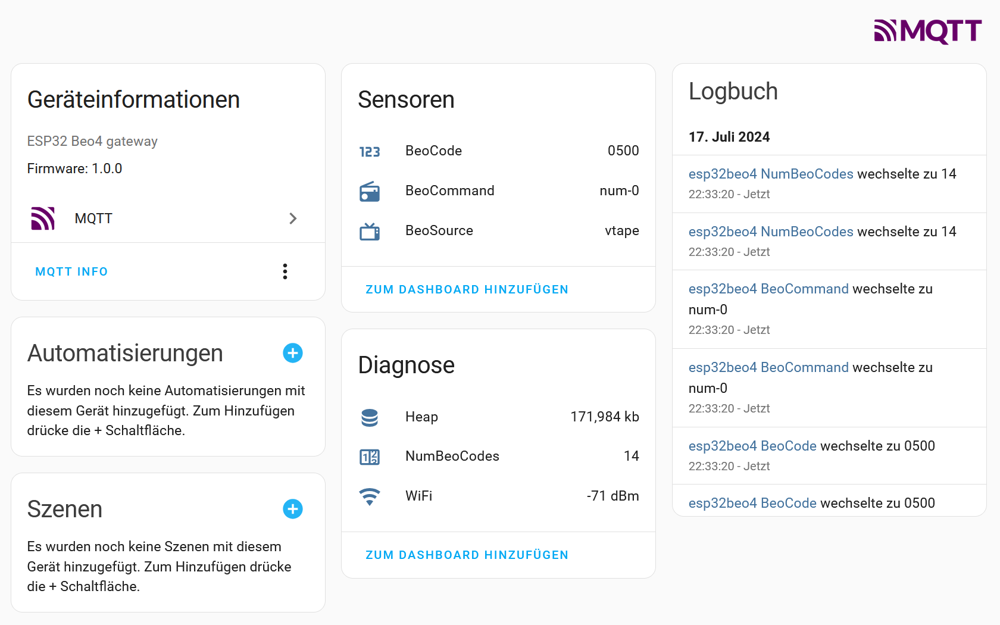

# Example for Home Assistant MQTT auto discovery
The example shows how to integrate the esp32beo4 device into the MQTT integration within Home Assistant. That is done by sending the auto discovery MQTT messages, in order to introduce the several sensors, e.g. the BeoCode sensor that is the received beo4 code from the remote control. The example provides the `BeoCode`, the `BeoCommand` and the `BeoSource` text sensors that appears inside the **Sensor** section and the `Heap`, the `NumBeoCodes` and the `WiFi` sensors that appear inside the **Diagnostics** section



The auto discovery MQTT messages are JSON formatted, as seen in following example for the `BeoCode` Sensor. 


```JSON
{
  "name": "BeoCode",
  "unique_id": "2CB8B81FB608_BeoCode",
  "icon": "mdi:numeric",
  "value_template": "{{ value_json.BeoCode}}",
  "state_topic": "esp32beo4/sens",
  "device": {
    "name": "esp32beo4",
    "sw_version": "1.0.0",
    "model": "ESP32 Beo4 gateway",
    "identifiers": [
      "2CB8B81FB608"
    ]
  }
}
```
The `unique_id` is build from the name and parts of the MAC address of the EPS32. The `name` is found in several parameters like the `value_template` Important is that the Topic of the discovery message is build from the home assistant path, the `state_topic` and the `name` (concatenated with an `_`) 


```
path:        homeassistant/sensor/
state_topic: esp32beo4/sens
name:        BeoCode
suffix:      /config
Topic:       homeassistant/sensor/esp32beo4/sens_BeoCode/config
```

Once the device is introduced the `state_topic` is used as topic for sending the MQTT sensor data message, as seen in following example. 

```
topic: esp32beo4/sens
```
```JSON
{
  "BeoCode":    "1b9b",
  "BeoSource":  "light",
  "BeoCommand": "light-on"
}
```

## Building a Device 
The `device` entry within the discovery JSON structure is the same for all entities that are to be introduced. The the MQTT integration groups the single entities to one single device. `model` and `sw_version`  are just informations to shown in the device-information box top left. The `name` sets the device name and the identifiers is the unique ID from above. 

```JSON

  "device": {
    "name": "esp32beo4",
    "sw_version": "1.0.0",
    "model": "ESP32 Beo4 gateway",
    "identifiers": [
      "2CB8B81FB608"
    ]
  }

```

# ArduinoJson
The MQTT Json messages were generated with the ArduinoJson library. An online code generator could be found here https://arduinojson.org/v7/assistant/#/step1

Cope a needed Json message into the clipboard, then follow the steps and the corresponding code snipped is generated.

# Example of discovery message

```cpp
// generates Home Assistant auto discovery MQTT message for BeoCode text sensor
void discover_BeoCode(void) {
  if(mqttClient.connected()) {
    String data;                 // payload for mqtt message
    size_t n_data;               // payload length
    snprintf(&topic[0],1024,"homeassistant/sensor/%s_BeoCode/config",topic_sens);
    Serial.printf_P(PSTR("\n %s \n"),topic);
    JsonDocument doc;
    doc["name"]                = "BeoCode";
    doc["unique_id"]           = gUniqueId + "_BeoCode";
    doc["icon"]                = "mdi:numeric";
    doc["value_template"]      = "{{ value_json.BeoCode}}";
    doc["state_topic"]         = topic_sens;

    JsonObject device = doc["device"].to<JsonObject>();
    device["name"]             = gDevice;
    device["sw_version"]       = gVersion;
    device["model"]            = gModel;
    device["identifiers"][0]   = gUniqueId;
    Serial.println(" ");
    serializeJsonPretty(doc, Serial);
    doc.shrinkToFit();  // optional
    serializeJson(doc, data);
    mqttClient.publish(topic, data.c_str());
    Serial.println(" ");
  }
}
```

# Home Assistant MQTT integration state changes
The topic `homeassistant/status` is subscribed, to detect state changes of the HA MQTT integration. Once it is restarted the discovery messages have to be send, in order to re-new the eps32beo4 device within Home Assistant. So the callback function checks the incoming MQTT messages like so:

````cpp
// mqtt callback: handles received mqtt messages, the payload can't 
// be processed directly, it need to be copied into internal MqttMsg 
// String. If status==online the MQTT integration was restarted, 
// so the HomeAssistantDiscovery() has to be send again, to re-new 
// the device within the MQTT Integration
// @param topic, mqtt identifier
// @param payload, mqtt data
// @param length, length mqtt data
void mqtt_cb(char* topic, byte* payload, unsigned int length) {
  String MqttMsg;
  for(unsigned int ii=0;ii<length;ii++) {
    MqttMsg += (char)payload[ii]; 
  } 
  Serial.printf_P(PSTR("%s = %s len: %d \n"), topic, MqttMsg.c_str(), length);

  if(String(topic) == String("homeassistant/status")) {
    if(MqttMsg == "online") {
      HomeAssistantDiscovery();
    }
  }
}

````

# prepare for compile
In order to compile the secrets.h file has to be filled properly with correct WiFi and MQTT credentials. 


### secrets.h

```cpp
// wifi settings
constexpr const char* wifi_ssid   = "xxxxx" ;
constexpr const char* wifi_pass   = "yyyyyyyyyyyyyyyyyyyy" ;

// mqtt settings
constexpr const char* mqtt_server = "192.xxx.xxx.xxx";
constexpr const char* mqtt_user   = "the-mqtt-user-of-mqtt-integration";
constexpr const char* mqtt_pass   = "the-super-secret-password";

```

*Note:*
*The pioarduino based arduino-esp32 platform is used, in order to support che newer boards like ESP32-C6.*

- arduino-esp32 migration 2.x to 3.0<br>
https://docs.espressif.com/projects/arduino-esp32/en/latest/migration_guides/2.x_to_3.0.html#ledc

- arduino-esp32 for platformio<br>
https://github.com/pioarduino/platform-espressif32

### platformio.ini
```
[env:esp32dev]
platform = https://github.com/pioarduino/platform-espressif32/releases/download/stable/platform-espressif32.zip
board = esp32dev
framework = arduino

```