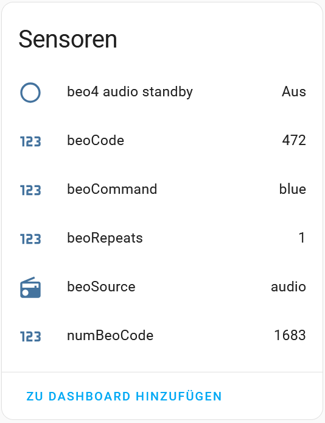

The beo4 encoder/decoder was integrated into the ESPHome `remote_base` component. See details --> pull request [#8307](https://github.com/esphome/esphome/pull/8307)

## 1. beo4 receiver  [esp32-beo4-rx.yaml](esphome/config/esp32-beo4-rx.yaml)
- set `external_component` to get the beo4 decoder within `remote_base` component
- set `binary_sensor` to get an sensor of an explicte beo4 IR remote control button, e.g. audio standby
- or set `on_beo4` to use a lambda code to handle received IR buttons in a generic way. Here lookup tables are used to get human readable translations of the received hex-codes (beo_source, beo_command). The source file beo4.h is included via `includes:` under `esphome:`

### 1.1. beo4 receiver YAML details
```yaml

external_components:
  - source: github://pr#8307
    components: [ remote_base ]

esphome:
  name: ${device_name}
  friendly_name: ${device_name}

  includes: 
    - includes/beo4.h

binary_sensor:
  - platform: remote_receiver
    name: "beo4 audio standby"
    filters:
      - delayed_off: 500ms
    beo4: 
      source: 0x01
      command: 0x0c


remote_receiver:
- pin:
    number: GPIO34
    inverted: true  # tsop7000 output is active-low
  idle: 30ms        # twice the longest data-pulse
  dump: beo4        # dump output
  on_beo4:
  then:
    - lambda: |-
        auto beo_rpt=x.repeats;
        auto beo_src=x.source;
        auto beo_cmd=x.command;
        int32_t beo_code = ((int32_t)(beo_src)<<8) + (int32_t)beo_cmd;
        const char* str_beo_src=beo_src_tbl(beo_src);
        const char* str_beo_cmd=beo_cmd_tbl(beo_cmd);
        id(id_beoCnt) +=1; 
        auto beo_cnt=id(id_beoCnt);
        id(id_beoCode).publish_state(beo_code);
        id(id_beoSource).publish_state(str_beo_src); 
        id(id_beoCommand).publish_state(str_beo_cmd); 
        id(id_beoRepeats).publish_state(beo_rpt);
        id(id_numBeoCode).publish_state(beo_cnt);
        ESP_LOGI("main","%3d %s %s %d", beo_cnt, str_beo_src, str_beo_cmd, beo_rpt);

```
### 1.2. beo4 receiver sensors
The device shows the binary sensor "audio standby" and the generic sensors with the human readable sensors beoCommand and beoSource




## 2. beo4 transmitter [esp32-beo4-tx.yaml](esphome/config/esp32-beo4-tx.yaml)
- set `external_component` to get the beo4 decoder within `remote_base` component
- set `actions:` in `api:` section and additional lambda code to provide a generic interface for sending beo4 codes

### 1.2. beo4 transmitter YAML details
```yaml
external_components:
  - source: github://pr#8307
    components: [ remote_base ]

api: 
  actions:
    - action: send_beo_code
      variables: 
        beo_src: int
        beo_cmd: int
        beo_rpt: int
      then: 
      - lambda: |- 
          uint8_t beo_source=(uint8_t) beo_src;
          uint8_t beo_command=(uint8_t) beo_cmd;
          
          ESP_LOGI("main","repeat=%d",beo_rpt);
          for(int32_t ic=0; ic < beo_rpt ; ic++) {
            auto call = id(beo4_tx).transmit();
            esphome::remote_base::Beo4Data beo4_data = { beo_source, beo_command };
            esphome::remote_base::Beo4Protocol().encode(call.get_data(), beo4_data);
            call.perform();
            id(id_beoCnt) += 1; 
            auto beo_cnt=id(id_beoCnt);
            id(id_numBeoCode).publish_state(beo_cnt);
          }

```

### 1.3. Action with a button on a dashboard
The generic interface can be used to create a button on a home-assistant dashboard and set a `tap_action` for a beo4 code like so:

```yaml
tap_action:
  action: perform-action
  perform_action: esphome.esp32_beo4_tx_send_beo_code
  data:
    beo_rpt: 1
    beo_src: 1
    beo_cmd: 13
```

## 3. Tests with pyscript
The script `config/pyscript/beo4.py` supports a lookup table so that beo4 codes can be send in human readable form. 

### 3.1. pyscript [beo4.py](pyscript/beo4.py)
```python
# beo4 source table
stbl = {
    'VIDEO' :'00',
    'AUDIO' :'01',
    'VTAPE' :'05',
    'ALL'   :'0F',
    'SPDEMO':'1D',
    'LIGHT' :'1B',
}

# beo4 command table
ctbl = {
    'NUM-0'         :'00',
    'NUM-1'         :'01',
    'NUM-2'         :'02',
    'NUM-3'         :'03',
    'NUM-4'         :'04',
...
    'BLUE'          :'D8',
    'RED'           :'D9',
    'STAND'         :'f7'
}

# lookup beoSrc and beoCmd and call esphome action 
@service 
def beo4Send(beo_src, beo_cmd, beo_rpt = 1):
    source = int(stbl[beo_src],16)
    command = int(ctbl[beo_cmd],16)
    repeat = int(beo_rpt)
    esphome.esp32_beo4_tx_send_beo_code(beo_src = source , beo_cmd = command, beo_rpt = repeat)

# send command and compare with received
@service 
def beo4SendInfo(beo_src="AUDIO", beo_cmd="GO"):
    source = int(stbl[beo_src],16)
    command = int(ctbl[beo_cmd],16)
    beo_code = f'0x{stbl[beo_src]}{ctbl[beo_cmd]}'
    beoCode = int((source * 256) + command)
    esphome.esp32_beo4_tx_send_beo_code(beo_src = source , beo_cmd = command, beo_rpt = 1)
    task.sleep(1)
    rxBeoSrc = sensor.esp32_beo4_rx_beosource.upper()
    rxBeoCmd = sensor.esp32_beo4_rx_beocommand.upper()
    rxBeoCode= int(sensor.esp32_beo4_rx_beocode)
    res = 'OK' if rxBeoCode==beoCode else 'FAIL'
    log.info(f'{beo_code:<7} {beo_src:<5} {beo_cmd:<20} {rxBeoSrc:<5} {rxBeoCmd:<20} {res}')


# send a couple of commands
@service
def beo4Test(n_repeat = 1):
    log.info(f'beoCode sended                     received')
    log.info(f'------- -------------------------- -------------------------')
    cnt= int(n_repeat)
    for x in range (cnt):
        beo4SendInfo('AUDIO','VOL-DOWN')
        beo4SendInfo('AUDIO','MUTE')
        beo4SendInfo('AUDIO','VOL-UP')
        beo4SendInfo('LIGHT','NUM-1')
        beo4SendInfo('LIGHT','NUM-2')
        beo4SendInfo('LIGHT','NUM-3')
        beo4SendInfo('AUDIO','RADIO')
        beo4SendInfo('AUDIO','NUM-1')
        beo4SendInfo('AUDIO','NUM-2')
        beo4SendInfo('VIDEO','TV')
        beo4SendInfo('AUDIO','CD')
        beo4SendInfo('ALL'  ,'STANDBY')
        beo4SendInfo('AUDIO','GREEN')
        beo4SendInfo('AUDIO','UP')
        beo4SendInfo('AUDIO','YELLOW')
        beo4SendInfo('AUDIO','LEFT')
        beo4SendInfo('AUDIO','GO')
        beo4SendInfo('AUDIO','RIGHT')
        beo4SendInfo('AUDIO','RED')
        beo4SendInfo('AUDIO','DOWN')
        beo4SendInfo('AUDIO','BLUE')
    log.info(f'------- -------------------------- -------------------------')

```

### 3.2. using beo4Send() function
Buttons in the Home-Assistant dashboard can be done like so:

```yaml
tap_action:
  action: perform-action
  perform_action: pyscript.beo4send
  data:
    beo_src: AUDIO
    beo_cmd: RADIO
``` 

### 3.3. using beo4Test() function
The function beo4Test() can be used in an experimental setup with a sender and a receiver, comparing the sended with the received beo4codes. The log can be found within `config/home-assistant.log` 


### config/home-assistant.log
```
2025-03-26 17:06:39.789 INFO (MainThread) [custom_components.pyscript.file.beo4.beo4Test] beoCode sended                     received
2025-03-26 17:06:39.789 INFO (MainThread) [custom_components.pyscript.file.beo4.beo4Test] ------- -------------------------- -------------------------
2025-03-26 17:06:40.791 INFO (MainThread) [custom_components.pyscript.file.beo4.beo4Test] 0x0164  AUDIO VOL-DOWN             AUDIO VOL--                OK
2025-03-26 17:06:41.794 INFO (MainThread) [custom_components.pyscript.file.beo4.beo4Test] 0x010D  AUDIO MUTE                 AUDIO MUTE                 OK
2025-03-26 17:06:42.797 INFO (MainThread) [custom_components.pyscript.file.beo4.beo4Test] 0x0160  AUDIO VOL-UP               AUDIO VOL++                OK
2025-03-26 17:06:43.799 INFO (MainThread) [custom_components.pyscript.file.beo4.beo4Test] 0x1B01  LIGHT NUM-1                LIGHT NUM-1                OK
2025-03-26 17:06:44.800 INFO (MainThread) [custom_components.pyscript.file.beo4.beo4Test] 0x1B02  LIGHT NUM-2                LIGHT NUM-2                OK
2025-03-26 17:06:45.803 INFO (MainThread) [custom_components.pyscript.file.beo4.beo4Test] 0x1B03  LIGHT NUM-3                LIGHT NUM-3                OK
2025-03-26 17:06:46.806 INFO (MainThread) [custom_components.pyscript.file.beo4.beo4Test] 0x0181  AUDIO RADIO                AUDIO RADIO-ON             OK
2025-03-26 17:06:47.808 INFO (MainThread) [custom_components.pyscript.file.beo4.beo4Test] 0x0101  AUDIO NUM-1                AUDIO NUM-1                OK
2025-03-26 17:06:48.810 INFO (MainThread) [custom_components.pyscript.file.beo4.beo4Test] 0x0102  AUDIO NUM-2                AUDIO NUM-2                OK
2025-03-26 17:06:49.813 INFO (MainThread) [custom_components.pyscript.file.beo4.beo4Test] 0x0080  VIDEO TV                   VIDEO TV-ON                OK
2025-03-26 17:06:50.815 INFO (MainThread) [custom_components.pyscript.file.beo4.beo4Test] 0x0192  AUDIO CD                   AUDIO CD-ON                OK
2025-03-26 17:06:51.818 INFO (MainThread) [custom_components.pyscript.file.beo4.beo4Test] 0x0F0C  ALL   STANDBY              ALL   STANDBY              OK
2025-03-26 17:06:52.820 INFO (MainThread) [custom_components.pyscript.file.beo4.beo4Test] 0x01D5  AUDIO GREEN                AUDIO GREEN                OK
2025-03-26 17:06:53.823 INFO (MainThread) [custom_components.pyscript.file.beo4.beo4Test] 0x011E  AUDIO UP                   AUDIO UP                   OK
2025-03-26 17:06:54.825 INFO (MainThread) [custom_components.pyscript.file.beo4.beo4Test] 0x01D4  AUDIO YELLOW               AUDIO YELLOW               OK
2025-03-26 17:06:55.826 INFO (MainThread) [custom_components.pyscript.file.beo4.beo4Test] 0x0132  AUDIO LEFT                 AUDIO LEFT                 OK
2025-03-26 17:06:56.829 INFO (MainThread) [custom_components.pyscript.file.beo4.beo4Test] 0x0135  AUDIO GO                   AUDIO GO                   OK
2025-03-26 17:06:57.830 INFO (MainThread) [custom_components.pyscript.file.beo4.beo4Test] 0x0134  AUDIO RIGHT                AUDIO RIGHT                OK
2025-03-26 17:06:58.833 INFO (MainThread) [custom_components.pyscript.file.beo4.beo4Test] 0x01D9  AUDIO RED                  AUDIO RED                  OK
2025-03-26 17:06:59.835 INFO (MainThread) [custom_components.pyscript.file.beo4.beo4Test] 0x011F  AUDIO DOWN                 AUDIO DOWN                 OK
2025-03-26 17:07:00.837 INFO (MainThread) [custom_components.pyscript.file.beo4.beo4Test] 0x01D8  AUDIO BLUE                 AUDIO BLUE                 OK

```

