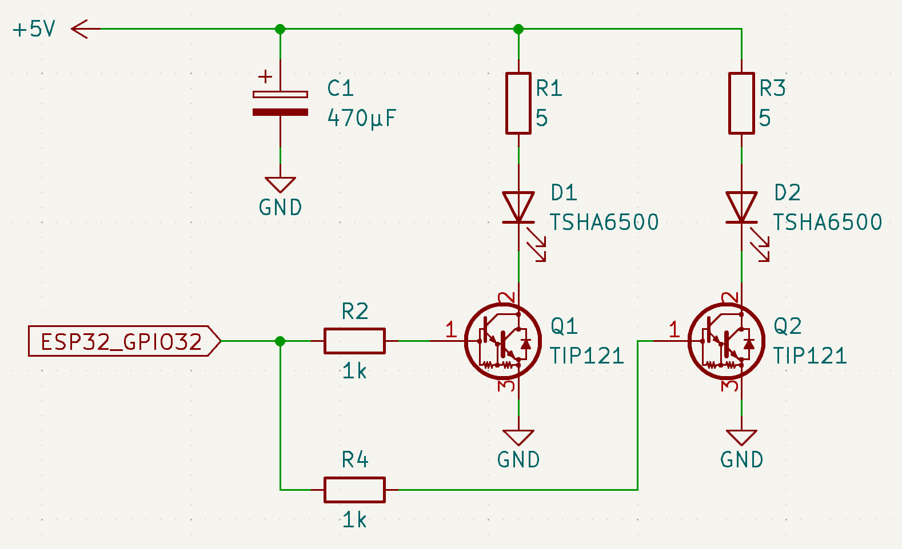
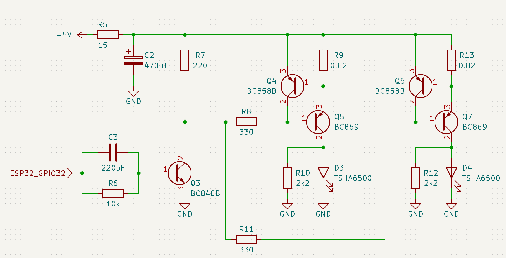

# Example for transmitter

To build only a IR transmitter, the `rx_pin` is set to -1 when creating the `IrBeo4` class. In addition, a queue `beo4_tx_queue` is set up to which the beoCodes can be pushed. When the task is started with `beo4.Begin(NULL,beo4_tx_queue)`, the first parameter for the receive queue is set to NULL. For testing a table with a few beoCodes can be created, that are then pushed cyclically into the queue within the `loop()` function. The minimal example that sends several beoCodes could be like so: 


```cpp
#include <Arduino.h>
#include "IrBeo4.h"
#include "IrBeo4Info.h"

// Beo4 stuff
constexpr uint8_t IR_TX_PIN = 32;      // IR transmit pin 
constexpr uint8_t numBeo    = 10;
static IrBeo4 beo4(-1,IR_TX_PIN);      // transmit only
static xQueueHandle beo4_tx_queue;     // queue for beo4codes from transmitter
static uint32_t beoCnt=0;              // loop counter thru beoCodes[]
static uint32_t beoCodes[numBeo] = {   // sample of Beo4-Codes
  ((uint32_t)BEO_SRC_AUDIO << 8) + (uint32_t)BEO_CMD_VOL_UP,
  ((uint32_t)BEO_SRC_AUDIO << 8) + (uint32_t)BEO_CMD_VOL_DOWN,
  ((uint32_t)BEO_SRC_AUDIO << 8) + (uint32_t)BEO_CMD_RADIO,
  ((uint32_t)BEO_SRC_VIDEO << 8) + (uint32_t)BEO_CMD_TV,
  ((uint32_t)BEO_SRC_AUDIO << 8) + (uint32_t)BEO_CMD_CD,
  ((uint32_t)BEO_SRC_AUDIO << 8) + (uint32_t)BEO_CMD_NUM_1,
  ((uint32_t)BEO_SRC_AUDIO << 8) + (uint32_t)BEO_CMD_NUM_2,
  ((uint32_t)BEO_SRC_LIGHT << 8) + (uint32_t)BEO_CMD_NUM_0,
  ((uint32_t)BEO_SRC_LIGHT << 8) + (uint32_t)BEO_CMD_NUM_1,
  ((uint32_t)BEO_SRC_LIGHT << 8) + (uint32_t)BEO_CMD_NUM_2,
};

// example for a transmit only device: create beo4_tx_queue and call 
// beo4.Begin(NULL,beo4_tx_queue), this will skip the beo4_rx_task() 
// and start the beo4_tx_task() only
void setup_beo4_tx(void) {
  pinMode(IR_TX_PIN, OUTPUT);
  Serial.printf(PSTR("===> start beo4... ")); 
  beo4_tx_queue = xQueueCreate(50, sizeof(uint32_t)); 
  static int beo4_ok=beo4.Begin(NULL,beo4_tx_queue);
  Serial.printf(PSTR("%s\n"),beo4_ok==0? "OK":"failed");
}

constexpr unsigned long period=2000;   // do something every 2 sec.
static unsigned long t0=0;             // timestamp to compare with

void setup() {
  Serial.begin(115200);
  setup_beo4_tx();
  t0=millis();
}

void loop() {
  unsigned long t1=millis();
  if((t1-t0) > period) {
    uint32_t beoCode=beoCodes[beoCnt];
    xQueueSend(beo4_tx_queue,&beoCode,0);
    beoCnt = (beoCnt < numBeo-1) ? beoCnt+1 : 0;
    t0=millis();
  }
}

```

# IR Sender Hardware
This circuit with two TIP121 transistors, which I had in my tinkering box, was successfully tested with a BeoSystem 2500 system. The transmitter also worked at the other end of the room (approx. 7m). It should be noted that the receivers in the Beo systems are designed for 880nm. The TSHA6500 diodes from Vishay, for example, are therefore suitable.


Another circuit from a B&O service manual should also work well. However, the transistors must be soldered as SMDs. 



